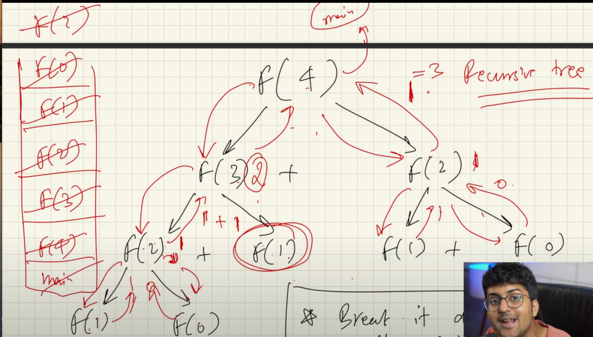

# recursion .
   recursion is the basics of almost every  thing .--> in simple words it is a thing that calls it self.IT IS THE MOST IMPORTANT PART.


## general misconception .

``` java
public static void main(String[] args) {
    message();
}

static void message() {
    System.out.println("hello");
}
```
==>> ``` if i don't write static will it run ?```
If you don't write the `static` keyword before the `message` method, the code will not compile successfully. The reason is that the `main` method is declared as `static`, and it is trying to call the `message` method directly without creating an instance of the class.

If you remove the `static` keyword from the `message` method, you will encounter a compilation error. This is because the `main` method, which is `static`, cannot call a non-static method directly. Non-static methods are associated with instances of a class and require an object to be invoked.

To resolve the compilation error, you have a few options:

1. Declare the `message` method as `static`: If the `message` method does not depend on any instance-specific state or variables, you can declare it as `static` to allow the `main` method to call it directly without creating an instance of the class.

```java
public static void main(String[] args) {
    message();
}

static void message() {
    System.out.println("hello");
}
```

2. Create an instance of the class and call the non-static method: If the `message` method relies on instance-specific variables or behavior, you would need to create an instance of the class and call the method on that instance.

```java
public static void main(String[] args) {
    MyClass myObject = new MyClass();
    myObject.message();
}

void message() {
    System.out.println("hello");
}
```

In summary, if you want to call a method directly from the `main` method without creating an instance of the class, you need to declare that method as `static`. Otherwise, you would need to create an instance of the class and call the non-static method on that instance.

# why use the recursion?
1. it helps in solving bigger and complex problems in simple way.
2. you can convert the recursion to the iteration and vise versa.
3. space complexity is not constant due to the recursive calls.

# example of recurcion .

printing numbers .``` if there is a problem in the  understanding just use the debugger tool and understand the call stack :the main point is after the function is called the function always left the stack```

``` java 
    // this is a perfect example of using the recursion
    public class printing {
    public static void main(String[] args) {

        // this is a simple program that print number 12345 by using the recursion.
        print(1); // passing the value of n = 1 ; in the function

        
    }
    
public static void print(int n) {
    if(n== 5){ // this statement is the base statement .
        System.out.println(5);
        return ; // if n = 5 then return to the previous 
    }
    System.out.println(n);// print the num that is given in the input.
    // again calling the same function by increasing the value by 1
    print(n+1);
    // this is a tailed recursion there is no case like addition of somthing and returning.
    
}

    
}

```

# how to understand and approach a problem 
1. identify if you can break the problem into smaller problem .
2. write the recursion relation if needed.
3. draw the recursion tree.
 * See the flow of the function how are they getting in the stack.
 * identify and focus on the left tree calls or the write tree calls. eg -> in the fibonacchi program u have written fibon(n-1) + fibon(n-2) ; here i am trying to say that first the fibon(n-1) will execute then the fibon(n-2) will execute ..... and the recursion process will continue till continue like the fibon(n-1) + fibon(n-2)... until it reachs the end point .... fibon of( n-1 ) has not finished executing so you cannot execute the fibon(n-2)
.
* draw the tree and the pointer again and again using pen and paper.
* use a debugger to the flow to see the flow .
4. see how the values are returned at each step..se how the function call will come out of each step. In the end you will come out of the main function.

# two key areas
1. how to call the function and the trees and that kind of stuff.
2. the second most important thing is variable 

In the fibonacci example there are three types variables ..one is in the argument ,, the other is which is being returned and the other is in the body.

## working with the variables in the recursion 
        * arguments // what ever you put in the arguments it is going in the next function call 
        * return type 
        * body of the function 

        notes :
        1. if there are variables that you want to pass in the future calls put it in the arguments with out thinking twice about it . example: the starting point and the ending points in the binary search ...this starting point and the ending point changes with the each iteration of the array.
        2. the value which is not beneficial to the future calls put it inside the body.
***binary search with the recursion:-***
At the every steps it does the two things . First is the comparing with the middlle number to know .. if the number we are going to find is belong to the right hand side or the left hand side .Therefore it is a one single step and it takes a constant time ( it does not depend on the size of the array). the second is the search in the array of ther (N/2).
``` F(N) = O(1) + f(N/2)```.. ```first part is for the comparison and the second part is for the search  ```
## types of reference 
1. linear recurrence -> fibonacci 
2. divide and conquer recurrence.

-------------------------------------------------------

Problem to find the last occurence of a number.
``` java
    package recursion;

public class prob8 {
    public static void main(String[] args) {
        // this is a program to find the last occurance of a number inside the array .
        
    }

    public static int lastOccur(int[] arr ,int index,int num){
        //base condition
        if(index == arr.length)
            return -1;
        // function
        int isFound = lastOccur(arr, index +1, num)  ;
        if(isFound == -1 && arr[index] == num)
            return index;
        
            return isFound ;

    }
    
}

```

this problem logic is a bit different but the logic is rather lame ;;; first it puts all the recursion in the  call stack ... ``` int isFound = lastOccur(arr, index +1, num)``` this  line does this job .The second conditon is when it is already in the call stack ``` if(isFound == -1 ```check the ``` arr[index] == num)``` then it returns the index . The first time it returns the number which is present first in the array .. but the second time it just over rides with the new number .. this happens until the last element present which matches the number . 
